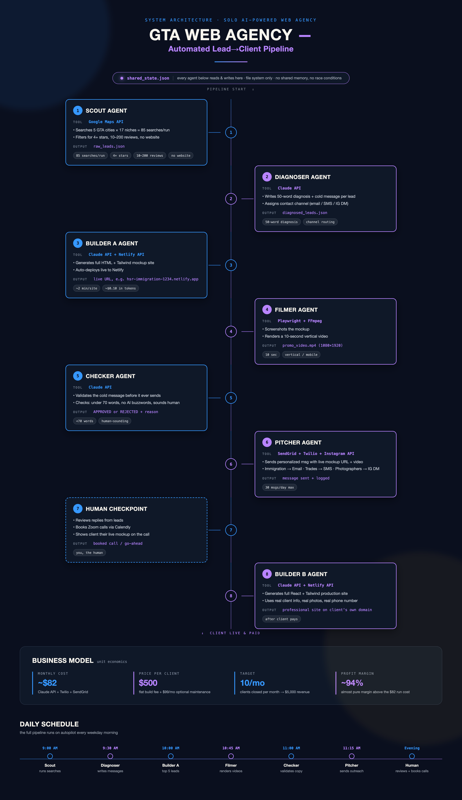

# Marsi Digital — Automated Lead-Gen & Web Mockup Pipeline

A multi-agent pipeline (Python + the Claude API) that finds small local businesses without a website, generates a personalized outreach pitch and a live web mockup for each one, and deploys it — built for a solo web design agency (marsidigital.ca) targeting the Greater Toronto Area.



## What it does

The pipeline is a chain of specialized agents, each backed by the Claude API for the parts that require judgment rather than fixed logic:

- **Scout** — queries the Google Maps Places API across GTA cities and business categories, filters by rating/review count, and flags businesses with no independently verifiable website
- **Diagnoser** — has Claude read each lead's profile (ratings, reviews, category) and write a tailored value proposition, cold-outreach message, and hero angle for that specific business
- **Vibe** — for flagship builds, fetches a business's real Google Maps photos and has Claude analyze their actual visual identity (colour palette, tone, cultural context) so the mockup reflects the real business instead of a generic template
- **Builder** — generates a complete, responsive single-page Tailwind CSS site per lead from the diagnosis (and vibe data, when available), then deploys it live via the Netlify API
- **Checker** — has Claude QC every generated outreach message before it's used, catching tone or accuracy issues
- **Orchestrator** — ties the pipeline together end-to-end: scout → diagnose → build → deploy → QC

## Tech stack

Python · Anthropic Claude API (multi-agent orchestration + vision) · Google Maps Places API · Netlify REST API · Tailwind CSS

## Repo structure

```
.
├── agents/
│   ├── scout_agent.py        # lead discovery + no-website verification
│   ├── diagnoser_agent.py    # Claude-generated pitch per lead
│   ├── vibe_agent.py         # real-photo-derived design identity
│   ├── builder_a_agent.py    # site generation + Netlify deploy
│   └── checker_agent.py      # QC pass on outreach messages
├── orchestrator.py           # runs the full pipeline
├── leads/                    # scraped + diagnosed lead data
└── clients/                  # generated mockups per business
```

## Running it

Requires API keys for Anthropic, Google Maps, and Netlify (see `.env.example`).

```bash
pip install -r requirements.txt
python agents/scout_agent.py       # find leads
python agents/diagnoser_agent.py   # generate pitches
python orchestrator.py             # build + deploy mockups
```

## See it live

Example generated mockups: [marsidigital.ca](https://marsidigital.ca)

## What this project demonstrates

- Coordinating multiple Claude API calls into a single pipeline, where each agent has a distinct, narrow responsibility rather than one large prompt doing everything
- Using Claude for both text generation (pitches) and vision (deriving a design system from real photos)
- Integrating three separate third-party APIs (Google Maps, Netlify, Anthropic) into one working system with live deployment, not just local output
- Iterating on a real, deployed system based on real-world results — including diagnosing and fixing a significant false-positive rate in the lead-sourcing logic through direct verification against live data

## Notes

This is an active, evolving project — the outreach step (calling/contacting leads) is currently manual and human-reviewed by design, not automated sending. `.env` holds live API keys and is git-ignored; see `.env.example` for the required variables.
